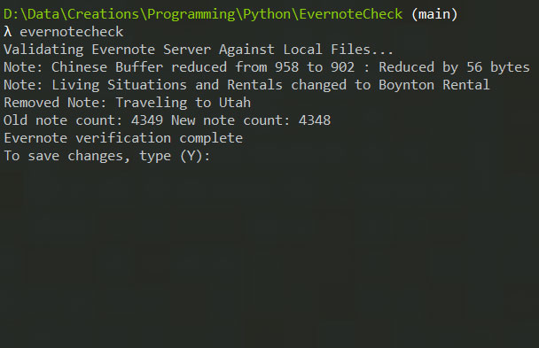

# evernotecheck
Python script to verify the integrity of your notes in Evernote. It looks for suspicious activity such as if the contents of the notes have decreased in size, or if some notes have been deleted and raises flags.

